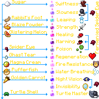

---
navigation:
  title: "Brewing"
  icon: "minecraft:brewing_stand"
  position: 1
  parent: lexicon:brewing.md
---

# Brewing

By placing at least one or more *Water Bottles* in the lower three slots of the [*Brewing Stand*](../useables/brewing_stand.md), an ingredient in the upper slot, and *Blaze Powder* in the fuel slot, a [*Player*](../creatures/human-player.md) can distill the ingredients into each [*Bottle*](./ingredients_equipments.md) and brew [*Potions*](#potions) that may be consumed to grant an effect to the [*Player*](../creatures/human-player.md). 

TODO: Unsupported flag 'border'

## Base Potions

Base potions are [*Potions*](#potions) without effects, brewed by adding a single base ingredient to a *Water Bottle*. Of these, only the *Awkward Potion* can be imbued with an effect ingredient to produce a [*Potion Effect*](./effects.md).

## Effect Potions

[*Potions*](#potions) are bottled substances which give [*Players*](../creatures/human-player.md) and mobs a limited-time or instant status effect if drunk or within its splash radius when thrown (in the case of [*Lingering*](./potion_types.md) and [*Splash Potions*](./potion_types.md)).

## Potion Upgrades

Upgrading a [*Potion*](#potions) involves a trade-off between duration & potency. An enhanced effect has shorter duration, & extended duration cannot have an enhanced effect.

<Recipe id="minecraft:brewing_stand" />

<Recipe id="minecraft:glass_bottle" />

