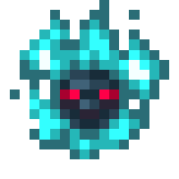
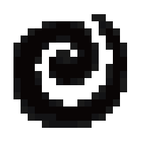

---
navigation:
  title: "Effects"
  icon: "minecraft:blaze_powder"
  position: 5
  parent: lexicon:brewing.md
---

# Effects

An effect is a helpful or harmful condition that affects an entity. 

Effects can be inflicted in various ways throughout the game, including consuming [*Potions*](./brewing.md#potions) and some food items, being in the range of [*Beacons*](../rare/beacon.md) and [*Conduits*](../rare/conduit.md), and being attacked by or close to certain mobs.

<ItemImage id="minecraft:milk_bucket" />

When drinking from *Milk Bucket*, dying, being saved from death by a [*Totem of Undying*](../rare/totem_of_undying.md), or traveling through the return portal in [*The End*](../exploring/end.md), all status effects are removed.

-----

## Speed

__Type:__ Positive 

__Effect:__ 
Increases walking speed; higher levels make the affected entity faster. 

__Sources:__ 
Potions, Tipped Arrows, [*Beacon*](../rare/beacon.md), [*/effect command*](../commands.md)

-----

## Slowness

__Type:__ Negative 

__Effect:__ 
Decreases walking speed; higher levels make the affected entity slower. 

__Sources:__ 
Potions, Tipped Arrows, [*/effect command*](../commands.md)

-----

## Haste

__Type:__ Positive 

__Effect:__ 
Increases mining and attack speed, higher levels increase the mining and attack speed. 

__Sources:__ 
[*Beacon*](../rare/beacon.md), [*/effect command*](../commands.md)

-----

## Mining Fatigue

__Type:__ Negative 

__Effect:__ 
Decreases mining and attack speed, higher levels decrease the mining and attack speed. 

__Sources:__ 
[Elder Guardian](../creatures/monster-elder_guardian.md), [*/effect command*](../commands.md)

-----

## Strength

__Type:__ Positive 

__Effect:__ 
Increases melee damage, higher levels make the affected entity do more melee damage. 

__Sources:__ 
Potions, Tipped Arrows, [*Beacon*](../rare/beacon.md), [*/effect command*](../commands.md)

-----

## Instant Health

__Type:__ Positive, Negative for Undead 

__Effect:__ 
Heals living entities, damages undead, higher levels heal more health and do more damage. 

__Sources:__ 
Potions, Tipped Arrows, [*/effect command*](../commands.md)

-----

## Instant Damage

__Type:__ Negative, Positive for Undead 

__Effect:__ 
Damages living entities, heals undead, higher levels do more damage and heal more health. 

__Sources:__ 
Potions, Tipped Arrows, [*/effect command*](../commands.md)

-----

## Jump Boost

__Type:__ Positive 

__Effect:__ 
Increases jump height and reduces fall damage, higher levels make the affected entity jump higher and reduces more fall damage. 

__Sources:__ 
Potions, Tipped Arrows, [*Beacon*](../rare/beacon.md), [*Suspicious Stew*](./suspicious_stew.md), [*/effect command*](../commands.md)

-----

## Nausea

__Type:__ Negative 

__Effect:__ 
Wobbles and warps the screen. 

__Sources:__ 
Eating a [*Pufferfish*](../creatures/aquatic_animal-pufferfish.md), [*/effect command*](../commands.md)

-----

## Regeneration

__Type:__ Positive 

__Effect:__ 
Regenerates health over time, higher levels make health regenerate quicker. 

__Sources:__ 
Potions, Tipped Arrows, [*Beacon*](../rare/beacon.md), [*Golden Apples*](../rare/golden_apple.md), [*Suspicious Stew*](./suspicious_stew.md), [*Totem of Undying*](../rare/totem_of_undying.md), [*/effect command*](../commands.md)

-----

## Resistance

__Type:__ Positive 

__Effect:__ 
Reduces damage, higher levels reduce more damage. 

__Sources:__ 
Potions, Tipped Arrows, [*Beacon*](../rare/beacon.md), [*Enchanted Golden Apple*](../rare/golden_apple.md), [*/effect command*](../commands.md)

-----

## Fire Resistance

__Type:__ Positive 

__Effect:__ 
Prevents the affected entity from taking damage due to *Fire*, *Lava* and other sources of fire damage. 

__Sources:__ 
Potions, Tipped Arrows, [*Enchanted Golden Apple*](../rare/golden_apple.md), [*Suspicious Stew*](./suspicious_stew.md), [*Totem of Undying*](../rare/totem_of_undying.md), [*/effect command*](../commands.md)

----

## Water Breathing

__Type:__ Positive 

__Effect:__ 
Prevents drowning and lets the affected entity breathe underwater. 

__Sources:__ 
Potions, Tipped Arrows, Turtle Shell, [*/effect command*](../commands.md)

-----

## Invisibility

__Type:__ Positive 

__Effect:__ 
Grants invisibility (but not the item they hold or the armor they wear), and reduces other mobs' detection range for the affected entity, higher levels reduce other mobs' detection range more. 

__Sources:__ 
Potions, [*/effect command*](../commands.md)

-----

## Blindness

__Type:__ Negative 

__Effect:__ 
Impairs vision and disables the ability to sprint and critical hit. 

__Sources:__ 
[*Suspicious Stew*](./suspicious_stew.md), [*Illusioner*](../creatures/human-illusioner.md), [*/effect command*](../commands.md)

-----

## Night Vision

__Type:__ Positive 

__Effect:__ 
Lets the [*Player*](../creatures/human-player.md) see well in darkness and underwater. 

__Sources:__ 
Potions, Tipped Arrows, [*Suspicious Stew*](./suspicious_stew.md), [*Conduit Power*](../rare/conduit.md), [*/effect command*](../commands.md)

-----

## Hunger

__Type:__ Negative 

__Effect:__ 
Increases food exhaustion, higher levels cause the [*Player*](../creatures/human-player.md) to starve quicker. 

__Sources:__ 
[*Husk*](../creatures/undead-husk.md), [*Pufferfish*](../creatures/aquatic_animal-pufferfish.md), Rotten Flesh, Raw Chicken, [*/effect command*](../commands.md)

-----

## Weakness

__Type:__ Negative 

__Effect:__ 
Decreases melee damage, higher levels decrease more melee damage. 

__Sources:__ 
Potions, Tipped Arrows, [*Suspicious Stew*](./suspicious_stew.md), [*/effect command*](../commands.md)

-----

## Poison

__Type:__ Negative 

__Effect:__ 
Inflicts damage over time (but can't kill), higher levels do more damage per second, doesn't affect undead. 

__Sources:__ 
Potions, Tipped Arrows, Poisonous Potato, Spider Eye, [*Pufferfish*](../creatures/aquatic_animal-pufferfish.md), [*Suspicious Stew*](./suspicious_stew.md), [*Cave Spider*](../creatures/arthropod-cave_spider.md), [*Bee*](../creatures/arthropod-bee.md), [*/effect command*](../commands.md)

-----

## Wither

__Type:__ Negative 

__Effect:__ 
Inflicts damage over time (can kill), higher levels do more damage per second. 

__Sources:__ 
Potions,  Wither Rose, [*Suspicious Stew*](./suspicious_stew.md), [*Wither*](../creatures/boss-wither.md), [*Wither Skeleton*](../creatures/undead-wither_skeleton.md), [*/effect command*](../commands.md)

-----

## Health Boost

__Type:__ Positive  

__Effect:__ 
Increases maximum health, higher levels give the affected entity more maximum health. 

__Sources:__ 
[*Golden Apples*](../rare/golden_apple.md), [*/effect command*](../commands.md)

-----

## Absorption

__Type:__ Positive   

__Effect:__ 
Adds damage absorption (additional hearts that can't be regenerated), higher levels give more absorption. 

__Sources:__ 
[*Golden Apples*](../rare/golden_apple.md), [*Totem of Undying*](../rare/totem_of_undying.md), [*/effect command*](../commands.md)

-----

## Saturation

__Type:__ Positive   

__Effect:__ 
Restores hunger and saturation. 

__Sources:__ 
[*Suspicious Stew*](./suspicious_stew.md), [*/effect command*](../commands.md)

-----

## Glowing

__Type:__ Neutral   

__Effect:__ 
Outlines the affected entity (can be seen through blocks). 

__Sources:__ 
Spectral Arrow, Bell for [*Villagers*](../creatures/human-villager.md) and [*Witches*](../creatures/human-witch.md), [*/effect command*](../commands.md)

-----

## Levitation

__Type:__ Neutral  

__Effect:__ 
Floats the affected entity upward. 

__Sources:__ 
[*Shulker*](../creatures/monster-shulker.md), [*/effect command*](../commands.md)

-----

## Luck

__Type:__ Positive   

__Effect:__ 
Can increase chances of high-quality and more loot, higher levels increase the chances of better loot. 

__Sources:__ 
Potions, Tipped Arrows, [*/effect command*](../commands.md)

-----

## Bad Luck

__Type:__ Negative   

__Effect:__ 
Can reduce chances of high-quality and more loot, higher levels reduce the chance of good loot. 

__Sources:__ 
[*/effect command*](../commands.md)

-----

## Slow Falling

__Type:__ Positive   

__Effect:__ 
Decreases falling speed and negates fall damage. 

__Sources:__ 
Potions, Tipped Arrows, [*/effect command*](../commands.md)

-----

## Conduit Power

__Type:__ Positive   

__Effect:__ 
Increases underwater visibility and mining speed, prevents drowning. 

__Sources:__ 
[*Conduit*](../rare/conduit.md), [*/effect command*](../commands.md)

-----

## Dolphin's Grace

__Type:__ Positive   

__Effect:__ 
Increases swimming speed. 

__Sources:__ 
Swimming with [*Dolphins*](../creatures/aquatic_animal-dolphin.md), [*/effect command*](../commands.md)

-----

## Bad Omen

__Type:__ Neutral  

__Effect:__ 
Bad Omen is an effect that ether transforms into [*Raid Omen*](effects.md#raid_omen) if in a [*Village*](../world/structures.md#village) or [*Trial Omen*](effects.md#trial_omen) if near a 
non-ominous [*Trial Spawner*](../rare/trial_spawner.md) 

__Sources:__ 
[*Ominous Bottle*](../rare/ominous_bottle.md), [*/effect command*](../commands.md)

-----

## Raid Omen

__Type:__ Neutral  

__Effect:__ 
This effect causes raids to start in [*Villages*](../world/structures.md#village) 

__Sources:__ 
Entering a [*Village*](../world/structures.md#village) with [*Bad Omen*](effects.md#bad_omen), [*/effect command*](../commands.md)

-----

## Trial Omen

__Type:__ Neutral  

__Effect:__ 
When a [*Player*](../creatures/human-player.md) receives this effect, they start an ominous trial. 
Any [*Trial Spawner*](../rare/trial_spawner.md) within 15 blocks immediately becomes ominous and joins the ominous trial. 

__Sources:__ 
Seeing a non-ominous [*Trial Spawner*](../rare/trial_spawner.md) with [*Bad Omen*](effects.md#bad_omen), [*/effect command*](../commands.md)

-----

## Hero of the Village

__Type:__ Positive  

__Effect:__ 
Gives discounts on trades with [*Villagers*](../creatures/human-villager.md), and makes them throw items at the [*Player*](../creatures/human-player.md) depending on their profession. 

__Sources:__ 
Completing a village raid, [*/effect command*](../commands.md)

-----

## Darkness

__Type:__ Negative  

__Effect:__ 
Darkens the screen. 

__Sources:__ 
Sculk Shrieker, [*Warden*](../creatures/boss-warden.md), [*/effect command*](../commands.md)

-----

## Wind Charged

__Type:__ Negative  

__Effect:__ 
This effect causes an entity to release a burst of wind upon death. 

__Sources:__ 
Potions, [*/effect command*](../commands.md)

-----

## Infested

__Type:__ Negative  

__Effect:__ 
This effect causes [*Silverfish*](../creatures/arthropod-silverfish.md) to spawn on an entity that is taking damage. 

__Sources:__ 
Potions, [*/effect command*](../commands.md)

-----

## Weaving

__Type:__ Negative  

__Effect:__ 
This effect makes *Cobweb* spawn upon an entity's death. 

__Sources:__ 
Potions, [*/effect command*](../commands.md)

-----

## Oozing

__Type:__ Negative  

__Effect:__ 
This effect causes two medium-sized [*Slimes*](../creatures/monster-slime.md) spawn upon an entity's death. 

__Sources:__ 
Potions, [*/effect command*](../commands.md)

