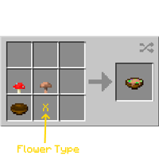

---
navigation:
  title: "Suspicious Stew"
  icon: "minecraft:suspicious_stew"
  position: 6
  parent: lexicon:brewing.md
---

# Suspicious Stew

Another way to get items with effects besides brewing are *Suspicious Stews*. 

They are food items that can give the [*Player*](../creatures/human-player.md) a [*Status effect*](effects.md) that depends on the flower used to craft it.

