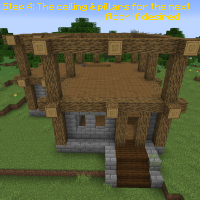

---
navigation:
  title: "Building Tips"
  icon: "minecraft:gold_nugget"
  position: 2
  parent: lexicon:building.md
---

# Building Tips

__Tip #1:__ 

- Add texture to your walls. 

You can put a block palette together to help. 

Look at [www.blockpalettes.com](https://www.blockpalettes.com) for some good ones!

## Texture

TODO: Unsupported flag 'border'

## Depth

__Tip #2:__ 

- Add depth to your buildings. 
It looks a lot more aesthetic!

TODO: Unsupported flag 'border'

## Overdetailing

__Tip #3:__ 

- Don't overdetailing your builds! 

In most cases too many details seem too overloaded.

TODO: Unsupported flag 'border'

## Step by Step

__Tip #4:__ 

- Don't mix everything up, build step by step.

TODO: Unsupported flag 'border'

