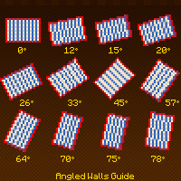
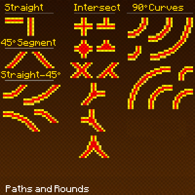
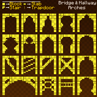
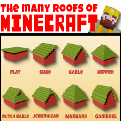
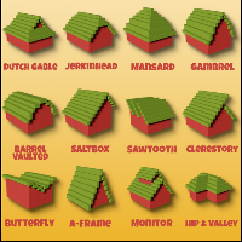
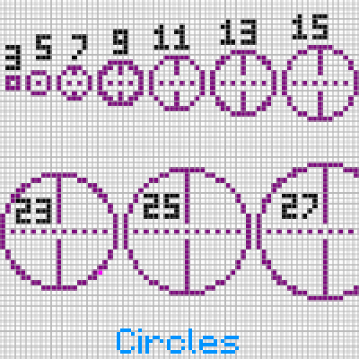

---
navigation:
  title: "Shape Templates"
  icon: "minecraft:stick"
  position: 3
  parent: lexicon:building.md
---

# Shape Templates

The following pages show useful templates to help you build.

<Color id="gray">by @PixelandPoly

TODO: Unsupported flag 'border'

<Color id="gray">by @PixelandPoly

TODO: Unsupported flag 'border'

<Color id="gray">by @PixelandPoly

TODO: Unsupported flag 'border'

<Color id="gray">by u/Jak03e

TODO: Unsupported flag 'border'

TODO: Unsupported flag 'border'

</Color></Color></Color></Color>