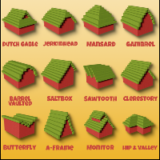

---
navigation:
  title: "Shape Templates"
  icon: "minecraft:stick"
  position: 3
  parent: lexicon:building.md
---

# Shape Templates

The following pages show useful templates to help you build.

  

<Color id="gray">by @PixelandPoly</Color>

-----

  

<Color id="gray">by u/Jak03e</Color>

