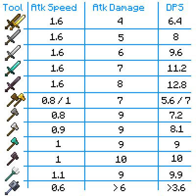
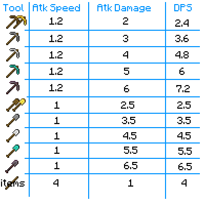

---
navigation:
  title: "Weapons"
  icon: "minecraft:iron_sword"
  position: 1
  parent: lexicon:combat.md
---

# Weapons

There are many different *Weapons* and *Tools* in the game that you can use to fight. 

There are a few things to consider: 

- Attack Damage 
- Attack Speed 
- Attack Cooldown 
- Critical Hits 
- Possible Enchantments

## Damage & Speed

DPS = Damage per second

## Attack Cooldown

When the [*Player*](../creatures/human-player.md) attacks too quickly, it reduces the strength of the attacks. 

The base damage done (as a fraction of the full possible damage) depends on the time between attacks, which is also reflected in the height of the held *Weapon* on screen and the attack indicator bar

## Critical Hits

A critical hit is an attack that deals extra damage compared to a regular attack. Critical melee strikes, regardless of the weapon used, cause small star particles to fly out of the target who was critically hit. *Arrows* shot from fully charged bows have a *25%* chance of becoming critical. 

In melee combat, a critical hit occurs when a [*Player*](../creatures/human-player.md) attacks a mob while falling, including while coming down from a jump, but not while jumping up. 
The attack deals *150%* of the attack's base damage.

## Other Weapons

- Bow or Crossbow with different types of arrows [
- Splash Potions [
- Lingering Potions 
- Snowballs (damages only [*Blazes*](../creatures/monster-blaze.md)](../brewing/potion_types.md#lingering_potion)](../brewing/potion_types.md#splash_potion)) 
- Explosives like TNT 
- Flint and steel 
- Lava Bucket

