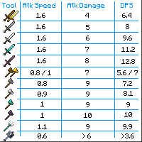

---
navigation:
  title: "Weapons"
  icon: "minecraft:iron_sword"
  position: 1
  parent: lexicon:combat.md
---

# Weapons

There are many different *Weapons* and *Tools* in the game that you can use to fight. 

There are a few things to consider: 

- Attack Damage 
- Attack Speed 
- Attack Cooldown 
- Critical Hits 
- Possible Enchantments

-----

## Damage & Speed

DPS = Damage per second

-----

## Attack Cooldown

When the [*Player*](../creatures/human-player.md) attacks too quickly, it reduces the strength of the attacks. 

The base damage done (as a fraction of the full possible damage) depends on the time between attacks, which is also reflected in the height of the held *Weapon* on screen and the attack indicator bar

-----

## Critical Hits

A critical hit is an attack that deals extra damage compared to a regular attack. Critical melee strikes, regardless of the weapon used, cause small star particles to fly out of the target who was critically hit. 
An <ItemLink id="minecraft:arrow" /> shot from a fully charged <ItemLink id="minecraft:bow" /> have a *25%* chance of becoming critical. 

In melee combat, a critical hit occurs when a [*Player*](../creatures/human-player.md) attacks a mob while falling, including while coming down from a jump, but not while jumping up. 
The attack deals *150%* of the attack's base damage.

-----

## Weapons

- Swords
- Axes
- <ItemLink id="minecraft:trident" />
- <ItemLink id="minecraft:bow" /> or <ItemLink id="minecraft:crossbow" /> with different types of arrows
- [*Splash Potions*](../brewing/potion_types.md#splash_potion)
- [*Lingering Potions*](../brewing/potion_types.md#lingering_potion)
- <ItemLink id="minecraft:snowball" /> (damages only [*Blazes*](../creatures/monster-blaze.md)) 
- Explosives like <ItemLink id="minecraft:tnt" /> or <ItemLink id="minecraft:end_crystal" /> 
- <ItemLink id="minecraft:flint_and_steel" /> or <ItemLink id="minecraft:fire_charge" />
- <ItemLink id="minecraft:lava_bucket" />

----

## Combat related recipes:

### Melee:

<Row>
    <RecipeFor id="minecraft:wooden_sword" />
    <RecipeFor id="minecraft:stone_sword" />
    <RecipeFor id="minecraft:golden_sword" />
    <RecipeFor id="minecraft:copper_sword" />
    <RecipeFor id="minecraft:iron_sword" />
    <RecipeFor id="minecraft:diamond_sword" />
    <Recipe id="minecraft:netherite_sword_smithing" />
</Row>

----

<Row>
    <RecipeFor id="minecraft:wooden_axe" />
    <RecipeFor id="minecraft:stone_axe" />
    <RecipeFor id="minecraft:golden_axe" />
    <RecipeFor id="minecraft:copper_axe" />
    <RecipeFor id="minecraft:iron_axe" />
    <RecipeFor id="minecraft:diamond_axe" />
    <Recipe id="minecraft:netherite_axe_smithing" />
</Row>

----

<Row>
    <RecipesFor id="minecraft:end_crystal" />
    <RecipesFor id="minecraft:tnt" />
    <RecipesFor id="minecraft:trident" />
    <RecipesFor id="minecraft:mace" />
    <RecipesFor id="minecraft:lava_bucket" />
    <RecipesFor id="minecraft:flint_and_steel" />
    <RecipesFor id="minecraft:fire_charge" />
</Row>

----

#### Ranged:

<Row>
    <RecipesFor id="minecraft:bow" />
    <RecipesFor id="minecraft:crossbow" />
    <RecipesFor id="minecraft:arrow" />
    <RecipesFor id="minecraft:tipped_arrow" />
    <RecipesFor id="minecraft:trident" />
</Row>