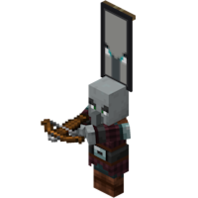
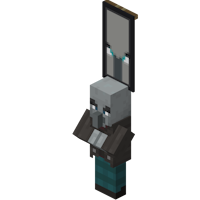
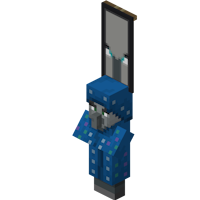

---
navigation:
  title: "Miniboss - Raid Captain"
  icon: "minecraft:ominous_bottle"
  parent: lexicon:creatures.md
---

# Miniboss - Raid Captain

A *Raid Captain* is the occurrence of an illager spawning with an [*Ominous Banner*](../rare/ominous_banner.md) on top of its head, usually a [*Pillager*](./human-pillager.md) or [*Vindicator*](./human-vindicator.md), or rarely an [*Evoker*](./human-evoker.md).
*Raid Captains* usually act the same as if they were a normal illager, but other illagers follow behind them.

> __Drops:__ 
> - 1 Ominous Banner 
> - 1 Ominous Bottle 
> - default drops of each mob   
> 
> __XP:__ 5-10

-----

## Pillager Captain

__Spawning:__ Illager Patrol, Raid, [*Pillager Outpost*](../world/structures.md#outpost)

## Vindicator Captain

__Spawning:__ Raid

## Evoker Captain

__Spawning:__ Raid (rare)

## Illusioner Captain

__Spawning:__ only with [*Commands*](../commands.md) or [*Mods*](../modifications/mods.md)

