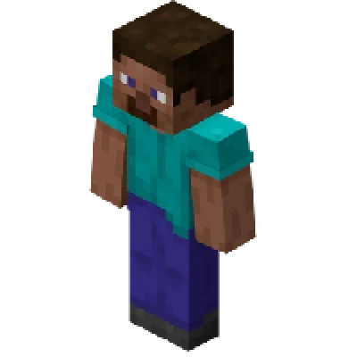

---
navigation:
  title: "Humanoid - Player"
  icon: "minecraft:player_head"
  parent: lexicon:creatures.md
---

# Humanoid - Player

> __Health:__ 20 + armor 
> __Attack Damage:__ 1 without tools 
> __Behavior:__ unpredictable 
> __Spawn:__ Player/World spawn point

__Drops:__ inventory  
__XP:__ varying

