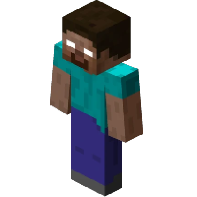

---
navigation:
  title: "Myth - Herobrine"
  icon: "minecraft:charcoal"
  parent: lexicon:creatures.md
---

# Myth - Herobrine

__Health:__ ?   
__Attack Damage:__ ?    
__Behavior:__ Hostile        
__Spawn:__ Unknown    
__Properties:__     
*Herobrine* is said to be *Notch's* dead brother, somehow embedded into Minecraft. 
He has bright white eyes that glow in the darkness, and is able to hold *Tools* and [*Weapons*](../combat/weapons.md) that deal massive damage.

-----

> __Drops:__ ?      
> __XP:__ ?

-----

## Herobrine Shrine

Legends say, that this shrine calls *Herobrine*:

<GameScene interactive={true} zoom={2}>
  <Block x="1" y="2" z="1" id="minecraft:fire" />
  <Block x="1" y="1" z="0" id="minecraft:redstone_torch" />
  <Block x="0" y="1" z="1" id="minecraft:redstone_torch" />
  <Block x="1" y="1" z="1" id="minecraft:netherrack" />
  <Block x="2" y="1" z="1" id="minecraft:redstone_torch" />
  <Block x="1" y="1" z="2" id="minecraft:redstone_torch" />
  <Block x="0" y="0" z="0" id="minecraft:gold_block" />
  <Block x="1" y="0" z="0" id="minecraft:gold_block" />
  <Block x="2" y="0" z="0" id="minecraft:gold_block" />
  <Block x="0" y="0" z="1" id="minecraft:gold_block" />
  <Block x="1" y="0" z="1" id="minecraft:soul_sand" />
  <Block x="2" y="0" z="1" id="minecraft:gold_block" />
  <Block x="0" y="0" z="2" id="minecraft:gold_block" />
  <Block x="1" y="0" z="2" id="minecraft:gold_block" />
  <Block x="2" y="0" z="2" id="minecraft:gold_block" />
</GameScene>

