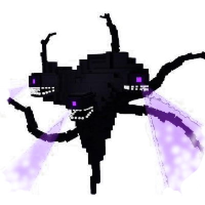
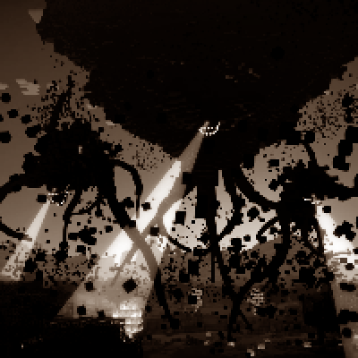

---
navigation:
  title: "Myth - Wither Storm"
  icon: "minecraft:wither_skeleton_skull"
  parent: lexicon:creatures.md
---

# Myth - Wither Storm

__Health:__ ?  
__Attack Damage:__ ?    
__Behavior:__ <Color id="dark_red">Very Hostile</Color>            
__Spawn:__ Unknown    
__Properties:__     
The *Wither Storm* is a more destructive version of the [*Wither*](./boss-wither.md). 
It sucks blocks and mobs to make it bigger and stronger. 
It eventually becomes a giant monster with 5 tentacles and three heads that can fire a tractor beam!  

-----

> __Drops:__ ?  
> __XP:__ ?

 

-----

Legends say, that this structure creates a *Wither Storm*:

<GameScene interactive={true} zoom={2}>
  <Block x="0" y="2" z="0" id="minecraft:wither_skeleton_skull"p:rotation="0" />
  <Block x="1" y="2" z="0" id="minecraft:wither_skeleton_skull"p:rotation="0" />
  <Block x="2" y="2" z="0" id="minecraft:wither_skeleton_skull"p:rotation="0" />
  <Block x="0" y="1" z="0" id="minecraft:soul_sand" />
  <Block x="1" y="1" z="0" id="minecraft:command_block"p:facing="down" />
  <Block x="2" y="1" z="0" id="minecraft:soul_sand" />
  <Block x="1" y="0" z="0" id="minecraft:soul_sand" />
</GameScene>

