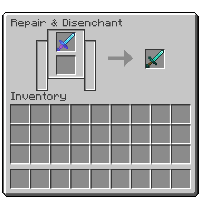

---
navigation:
  title: "Disenchanting"
  icon: "minecraft:grindstone"
  position: 2
  parent: lexicon:enchanting.md
---

# Disenchanting

<ItemImage id="minecraft:grindstone" />

The only way to disenchant items is via the [<ItemLink id="minecraft:grindstone" />](../useables/grindstone.md) or by repairing the items via the crafting grid. 

-----

Using the [<ItemLink id="minecraft:grindstone" />](../useables/grindstone.md) removes all [*Enchantments*](./enchantments.md) (except [*Curses*](./curses.md)) and gives experience back based on the level of the 
enchantment(s) and their value.

<Row>
    <RecipesFor id="minecraft:grindstone" />
    
</Row>
