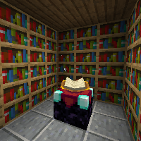
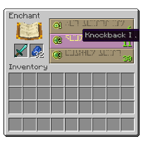

---
navigation:
  title: "Enchanting"
  icon: "minecraft:enchanting_table"
  position: 1
  parent: lexicon:enchanting.md
---

# Enchanting

__There are a few ways to enchant items:__ 
- Through an [*Enchanting Table*](../useables/enchanting_table.md) in exchange for experience points and *Lapis Lazuli*. Only unenchanted items may be enchanted this way. 
- Through an [*Anvil*](../useables/anvil.md), combining an *Enchanted Book* with an item. 
- Through an [*Anvil*](../useables/anvil.md), combining two of the same item with different existing enchantments into a single item that has the enchantments of both. 
- Through a librarian [*Villager*](../creatures/human-villager.md#librarian), which may enchant *Books* respectively for emeralds instead of *Lapis Lazuli* and experience.

<ItemImage id="minecraft:enchanting_table" />

An item can be enchanted by using an [*Enchanting Table*](../useables/enchanting_table.md) and placing the item in the input slots and 1–3 *Lapis Lazuli* in its dedicated slot. Upon placing the item, three randomized enchanting options appear on the right.

## Increasing the level

To increase the enchantment level, *Bookshelves* can be placed next to the [*Enchanting Table*](../useables/enchanting_table.md) while keeping one block of air between them. 

The only choices available have a level requirement equal to or below the player's current level and a *Lapis Lazuli* requirement equal to or below the number of lapis placed in the table.

TODO: Unsupported flag 'border'

<Recipe id="minecraft:enchanting_table" />

<Recipe id="minecraft:book" />

<Recipe id="minecraft:bookshelf" />

