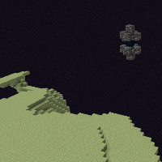
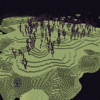

---
navigation:
  title: "What's next?"
  icon: "minecraft:end_stone"
  position: 4
  parent: lexicon:end.md
---

# What's next?

After defeating the final boss of Minecraft and seeing the credits, the game is still not over, there are still many things to discover! 

Minecraft has endless potential!

-----

Search the new generated end gateway portal und explore the outer lands of the [*End*](../world/dimensions.md#end)!

 

----

## Other things you can accomplish:

- Collect [*rare endgame items*](../rare_stuff.md) 

- Explore your world in all [*Dimensions*](../world/dimensions.md) 

- Get all [Advancements](https://minecraft.wiki/w/Advancement) 

- Kill the other [bosses](../creatures/bosses.md), like the [*Wither*](../creatures/boss-wither.md) 

- Build massive bases, [item farms](../farming.md), [machines](../redstone/redstone_contraptions.md) and other structures 

- Install and play with [*Mods*](../modifications/mods.md), [*Datapacks*](../modifications/datapacks.md) or on server with other play modes

- And much more!

