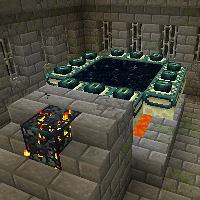

---
navigation:
  title: "The journey to the End"
  icon: "minecraft:end_portal_frame"
  position: 2
  parent: lexicon:end.md
---

# The journey to the End

The first important thing on your way to the [*End*](../world/dimensions.md#end) are *Eyes of Ender*. 

You can craft them with *Ender Pearls* which you get from [*Endermen*](../creatures/monster-enderman.md) or from bartering in the [*Nether*](../world/dimensions.md#nether) and *Blaze Dust* which you also get in the [*Nether*](../world/dimensions.md#nether) from [*Blazes*](../creatures/monster-blaze.md).

You need around 20 of them

<Recipe id="minecraft:blaze_powder" />

<Recipe id="minecraft:ender_eye" />

-----

The next step is to find a [*Stronghold*](../world/structures.md#stronghold). 

You can find one by throwing *Eyes of Ender* in the air, they will fly straight in the direction of the [*Stronghold*](../world/structures.md#stronghold). The eye has a 20% chance of shattering and an 80% chance of surviving per throw.  

If they stop and burst in midair, it's underneath.

-----

Locate the *End Portal*-Room in the [*Stronghold*](../world/structures.md#stronghold) and fill in the empty frame blocks with *Eyes of Ender*.

Before you go through the portal, make sure you have everything with you, once you go through you can't go back until you defeat the [*Ender Dragon*](../creatures/boss-ender_dragon.md) (the endboss of Minecraft) or die.

