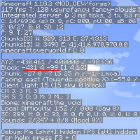

---
navigation:
  title: "Important things"
  icon: "minecraft:red_bed"
  parent: lexicon:exploring.md
---

# Important things

Before you travel and explore, you should make sure that you can find your way back! 

- Use a *Compass*, it always points to the *Spawnpoint* of your world, you should always be able to find your base from there. 
- Alternatively, you can use the *F3* key to display your coordinates in the world. 
- You can also mark your way with *Torches* or towers! 
- It's also important that you always have a [*Bed*](../useables/bed.md) in your base where you can respawn!

The *F3*-Screen shows you your coords and a lot of other useful information!

