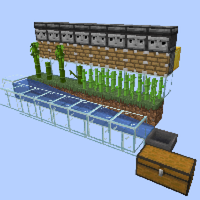
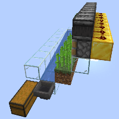
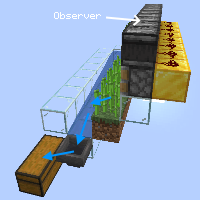
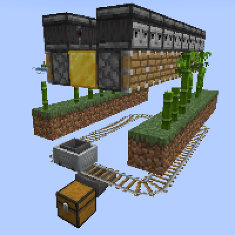
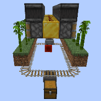

---
navigation:
  title: "Bamboo/SugarCane Farm"
  icon: "minecraft:bamboo"
  position: 5
  parent: lexicon:farming.md
---

# Bamboo/SugarCane Farm

This farm can harvest *Bamboo* and *Sugar Cane* fully automatically. 

When [*Observers*](../redstone/redstone_components.md#observer) realize that something has grown in front of them, the [*Pistons*](../redstone/redstone_components.md#piston) below destroy the plant and *Water* transports the drops to a [*Hopper*](../redstone/redstone_components.md#hopper).

  

-----

## Bigger Auto Bamboo Farm

Here, instead of *Water*, a *Hopper Minecart* is used to collect the items, it is more efficient and usually makes more sense on larger farms.

  

