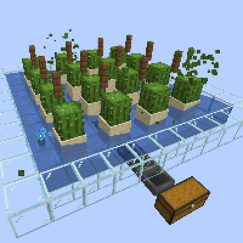
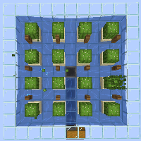
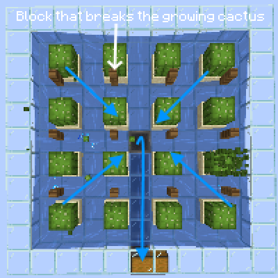

---
navigation:
  title: "Auto Cactus Farm"
  icon: "minecraft:cactus"
  position: 4
  parent: lexicon:farming.md
---

# Auto Cactus Farm

This simple farm uses the property that *Cactus* breaks and drops when it touches another block. 

The drops are then fed to a [*Hopper*](../redstone/redstone_components.md#hopper) using *Water*. 

The *[Hopper](../redstone/redstone_components.md#hopper)* then transports the items to a [*Chest*](../useables/chest.md).

  

