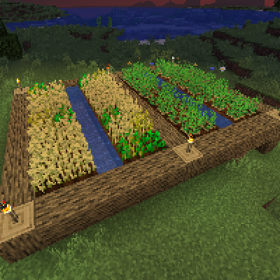

---
navigation:
  title: "Classic Food Farms"
  icon: "minecraft:bread"
  position: 1
  parent: lexicon:farming.md
---

# Classic Food Farms

The first farm you should always be a simple, classic <ItemLink id="minecraft:wheat" />- or *Vegetable*-farm.

__Requirements for most plant-based Farms__: 
- Transform <ItemLink id="minecraft:dirt" /> with a *Hoe* to <ItemLink id="minecraft:farmland" />.
- <ItemLink id="minecraft:farmland" /> needs a *Water* source up to 4 blocks away.
- Light is required.
- Many farms require their chunks to be ticked that the state of growth changes. That means a [*Player*](../creatures/human-player.md) must be nearby (within 128 blocks), or you use a *Chunk Loader* from a [*Mod*](../modifications/mods.md).

