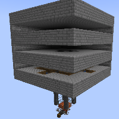

---
navigation:
  title: "Classic Mob Farm"
  icon: "minecraft:skeleton_skull"
  position: 2
  parent: lexicon:farming.md
---

# Classic Mob Farm

This farm doesn't focus on any specific monsters. It let them spawn which then pushed from the *Water* into a pit where they are killed by *Magma Blocks*. 
The drops are then transported into a [*Chest*](../useables/chest.md) by a *Hopper Minecart*. 

__A few things to note:__ 
- The spawn area has to be dark 
- Make the spawn are only 2 blocks high to prevent [*Enderman*](../creatures/monster-enderman.md) from spawning 
- Make the moats at least 2-3 blocks wide, that [*Spiders*](../creatures/arthropod-spider.md) don't block them

This farm can be expanded infinitely downwards.

TODO: Unsupported flag 'border'

