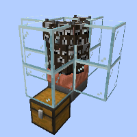
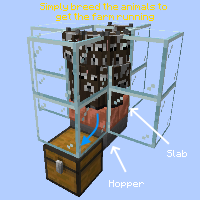

---
navigation:
  title: "Entity Cramming Farm"
  icon: "minecraft:beef"
  position: 5
  parent: lexicon:farming.md
---

# Entity Cramming Farm

Some farms that I would call a bit cheating 'exploit' game mechanics that weren't actually meant for that. 

The first variant of this would be to use *Entity Cramming* to kill mobs out of nowhere. 

- Entity Cramming has been implemented to prevent lag, if too many entities are in one spot it will cause the oldest one to be killed. 

- The maximum number is by default *24*. But it can be changed with this command: */gamerule maxEntityCramming [number]*

 