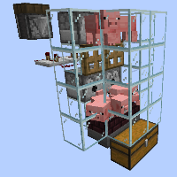
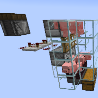
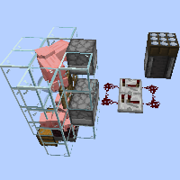
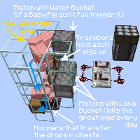

---
navigation:
  title: "Pig/Cow/Sheep Farm"
  icon: "minecraft:cooked_porkchop"
  position: 7
  parent: lexicon:farming.md
---

# Pig/Cow/Sheep Farm

Animals such as [*Pigs*](../creatures/animal-pig.md), [*Cows*](../creatures/animal-cow.md) & [*Sheeps*](../creatures/animal-sheep.md) can be farmed here. 

Some adults have to be caged above and paired so that the babies fall down and are grilled when they grow up.

TODO: Unsupported flag 'border'

