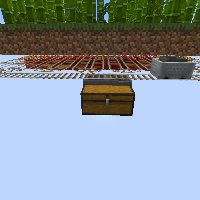

---
navigation:
  title: "Flying Machine Farms"
  icon: "minecraft:slime_block"
  position: 9
  parent: lexicon:farming.md
---

# Flying Machine Farms

If there are large areas that need to be farmed, the best way is with a [*Flying Machine*](../redstone/flying_machines.md). 

They can be used for a variety of farms  e.g. <ItemLink id="minecraft:bamboo" />, <ItemLink id="minecraft:sugar_cane" />,
<ItemLink id="minecraft:cactus" />, <ItemLink id="minecraft:kelp" />, ...

   

