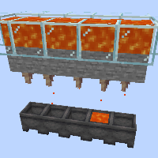

---
navigation:
  title: "Auto Lava/Water Farm"
  icon: "minecraft:lava_bucket"
  position: 6
  parent: lexicon:farming.md
---

# Auto Lava/Water Farm

This simple farm uses the fact that *Dripstones* drain liquids that are above them downwards, so that they can be slowly collected with *Cauldrons*. 

This does not use up the liquids.

