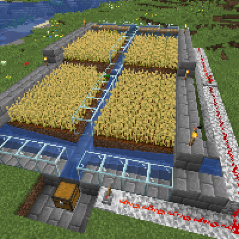
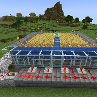
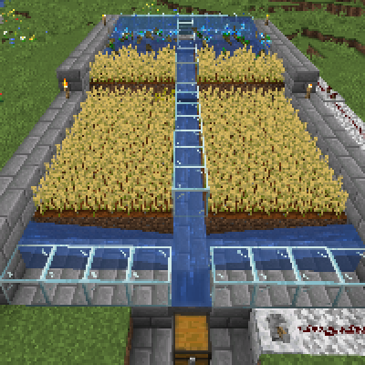
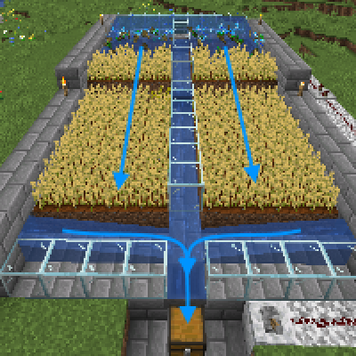

---
navigation:
  title: "Waterflow Food Farms"
  icon: "minecraft:wheat"
  position: 3
  parent: lexicon:farming.md
---

# Waterflow Food Farms

That's still a simple __semi-auto__ farm for crops that can be destroyed by *Water* (like *Wheat*, *Potatoes*, *Carrots*,...). 

(The glass is to illustrate the construction) 

- Flipping the [*Lever*](../redstone/redstone_components.md#lever) causes the [*Pistons*](../redstone/redstone_components.md#piston) to lower, allowing *Water* to flow down over the fields and flushing the drops into a [*Hopper*](../redstone/redstone_components.md#hopper) to a [*Chest*](../useables/chest.md).

## Semi-auto Wheat Farm

This farm can be expanded infinitely downwards.

TODO: Unsupported flag 'border'

