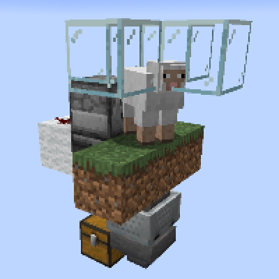
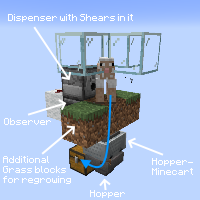

---
navigation:
  title: "Wool Farm"
  icon: "minecraft:white_wool"
  position: 6
  parent: lexicon:farming.md
---

# Wool Farm

This farm automatically shears the [*Sheep*](../creatures/animal-sheep.md) by testing with an [*Observer*](../redstone/redstone_components.md#observer) if the [*Sheep*](../creatures/animal-sheep.md) have grown new *Wool* from eating the *Grass* block. 

It's important that there are still additional *Grass* blocks to let the *Dirt* grow back.

 

