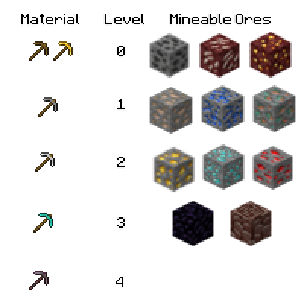

---
navigation:
  title: "Mining Levels"
  icon: "minecraft:diamond"
  position: 1
  parent: lexicon:mining.md
---

# Mining Levels

Not all *Ores* can be mined with the same *Pickaxe*. 

There are different mining levels depending on the material. 

The higher the level, the more ores can be mined.

[*Mods*](../modifications/mods.md) can add even more ores and mining levels to the game.

