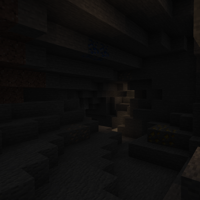
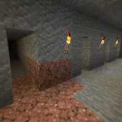
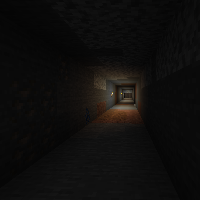
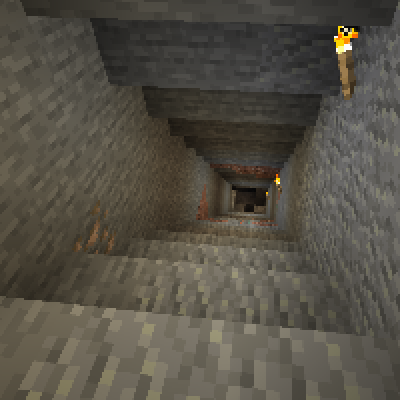
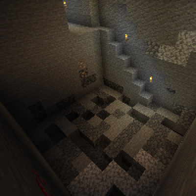
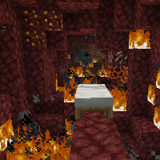
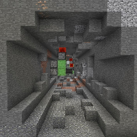

---
navigation:
  title: "Mining Techniques"
  icon: "minecraft:cobblestone"
  position: 3
  parent: lexicon:mining.md
---

# Mining Techniques

There are various techniques how *Ores* can be extracted from the ground, these are described on the following pages.

## Cave Mining

The classic way to mine. You can look for ores without mining a lot of *Stone*, but since some ores have reduced air exposure, the spawn chances are reduced a bit.

TODO: Unsupported flag 'border'

## Strip Mining

Strip mining is the most efficient way to farm ores, many small corridors are created next to each other in order to be able to cover the entire area.

TODO: Unsupported flag 'border'

## Tunnel Mining

Is often used if you want to travel underground in a certain direction anyway or tunnel systems are to be created.

TODO: Unsupported flag 'border'

## Shaft Mining

Is used to create a shaft to a certain height, ores from different levels are be covered.

TODO: Unsupported flag 'border'

## Quarry Mining

This variant is not particularly efficient, but covers the entire area with all resources, is often used with [*Mods*](../modifications/mods.md) that contain *Quarrys*.

TODO: Unsupported flag 'border'

## Explosion Mining

Mining with explosives is mainly used in conjunction with [*Ancient Debris*](../rare/netherite.md), since it's pretty much the fastest option in the [*Nether*](../world/dimensions.md#nether) using exploding [*Beds*](../useables/bed.md).

TODO: Unsupported flag 'border'

But *TNT* or [*Flying Machines*](../redstone/flying_machines.md) are also used.

TODO: Unsupported flag 'border'

