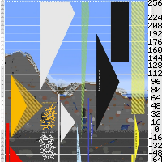
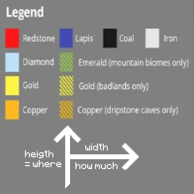

---
navigation:
  title: "Ore Distribution"
  icon: "minecraft:diamond_ore"
  position: 3
  parent: lexicon:mining.md
---

# Ore Distribution

*Ores* generate at different heights with different probability. 

Some are even less likely to generate in caves (Air exposured).

## Best Ore Layers

[*The Overworld*](../world/dimensions.md#overworld) 
- *Coal Ore*: Layer 95 & 136 
- *Copper Ore*: Layer 48 
- *Lapis Ore*: Layer -1 
- *Iron Ore*: Layer 15 & 232 
- *Gold Ore*: Layer -16 
- *Redstone Ore*: Layer -59 
- *Diamond Ore*: Layer -59 
- *Emerald Ore*: Layer 236 

[*The Nether*](../world/dimensions.md#nether) 
- *Nether Quartz*: Layer 10-114 
- *Gold Ore*: Layer 96-116 
- *Ancient Debris*: 13-17

The greatest variation in ores is around layer 0

TODO: Unsupported flag 'border'

