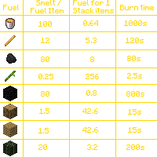
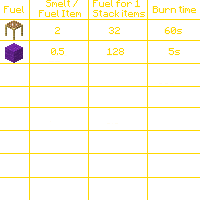
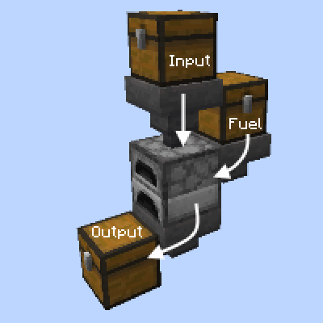
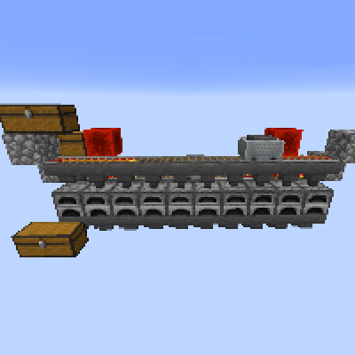
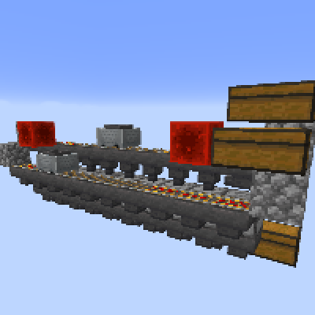

---
navigation:
  title: "Smelting"
  icon: "minecraft:furnace"
  position: 5
  parent: lexicon:mining.md
---

# Smelting

There are multiple fuels that can be used to smelt items. 
The type of fuel that should be used depends on the number of items in question. 

__Different types of smelter:__ 
- [**Furnace**](../useables/furnace.md) smelts all possible items 
- [**Blast Furnace**](../useables/blast_furnace.md) smelts only ores, but twice as fast 
- [**Smoker**](../useables/smoker.md) smelts only food, but twice as fast

**Smelt/Fuel Item** = How many items are smelted with 1 fuel 

**Fuel for 1 Stack items** = How many fuel is needed for 64 items (1 Stack)

 

-----

## Auto-Smelter

##  

<GameScene interactive={true} zoom={2}>
  <Block x="1" y="0" z="0" id="minecraft:chest"p:facing="north" />
  <Block x="1" y="1" z="0" id="minecraft:hopper"p:enabled="true" />
  <Block x="2" y="1" z="0" id="minecraft:chest"p:facing="north" />
  <Block x="1" y="2" z="0" id="minecraft:furnace"p:facing="north" />
  <Block x="2" y="2" z="0" id="minecraft:hopper"p:enabled="true" p:facing="north" />
  <Block x="0" y="3" z="0" id="minecraft:chest"p:facing="north" />
  <Block x="1" y="3" z="0" id="minecraft:hopper"p:enabled="true" p:facing="north" />
</GameScene>

-----

## Super Smelter

The best way to smelt a lot of ores after a mining session.

 

<GameScene interactive={true} zoom={2}>
  <Block x="0" y="0" z="1" id="minecraft:chest"p:facing="east" p:type="left" />
  <Block x="1" y="0" z="1" id="minecraft:chest"p:facing="east" p:type="right" />
  <Block x="0" y="1" z="0" id="minecraft:chest"p:facing="east" p:type="left" />
  <Block x="1" y="1" z="0" id="minecraft:chest"p:facing="east" p:type="right" />
  <Block x="2" y="1" z="0" id="minecraft:redstone_block" />
  <Block x="9" y="1" z="0" id="minecraft:redstone_block" />
  <Block x="0" y="1" z="1" id="minecraft:cobblestone" />
  <Block x="1" y="1" z="1" id="minecraft:powered_rail"p:shape="north_south" p:powered="true" />
  <Block x="2" y="1" z="1" id="minecraft:powered_rail"p:shape="north_south" p:powered="true" />
  <Block x="3" y="1" z="1" id="minecraft:powered_rail"p:shape="north_south" p:powered="true" />
  <Block x="4" y="1" z="1" id="minecraft:rail"p:shape="north_south" />
  <Block x="5" y="1" z="1" id="minecraft:rail"p:shape="north_south" />
  <Block x="6" y="1" z="1" id="minecraft:rail"p:shape="north_south" />
  <Block x="7" y="1" z="1" id="minecraft:rail"p:shape="north_south" />
  <Block x="8" y="1" z="1" id="minecraft:powered_rail"p:shape="north_south" p:powered="true" />
  <Block x="9" y="1" z="1" id="minecraft:powered_rail"p:shape="north_south" p:powered="true" />
  <Block x="10" y="1" z="1" id="minecraft:powered_rail"p:shape="north_south" p:powered="true" />
  <Block x="11" y="1" z="1" id="minecraft:cobblestone" />
  <Block x="0" y="2" z="0" id="minecraft:cobblestone" />
  <Block x="1" y="2" z="0" id="minecraft:powered_rail"p:shape="north_south" p:powered="true" />
  <Block x="2" y="2" z="0" id="minecraft:powered_rail"p:shape="north_south" p:powered="true" />
  <Block x="3" y="2" z="0" id="minecraft:powered_rail"p:shape="north_south" p:powered="true" />
  <Block x="4" y="2" z="0" id="minecraft:rail"p:shape="north_south" />
  <Block x="5" y="2" z="0" id="minecraft:rail"p:shape="north_south" />
  <Block x="6" y="2" z="0" id="minecraft:rail"p:shape="north_south" />
  <Block x="7" y="2" z="0" id="minecraft:rail"p:shape="north_south" />
  <Block x="8" y="2" z="0" id="minecraft:powered_rail"p:shape="north_south" p:powered="true" />
  <Block x="9" y="2" z="0" id="minecraft:powered_rail"p:shape="north_south" p:powered="true" />
  <Block x="10" y="2" z="0" id="minecraft:powered_rail"p:shape="north_south" p:powered="true" />
  <Block x="11" y="2" z="0" id="minecraft:cobblestone" />
  <Block x="1" y="2" z="1" id="minecraft:hopper"p:enabled="true" />
  <Block x="2" y="2" z="1" id="minecraft:hopper"p:enabled="true" />
  <Block x="3" y="2" z="1" id="minecraft:hopper"p:enabled="true" />
  <Block x="4" y="2" z="1" id="minecraft:hopper"p:enabled="true" />
  <Block x="5" y="2" z="1" id="minecraft:hopper"p:enabled="true" />
  <Block x="6" y="2" z="1" id="minecraft:hopper"p:enabled="true" />
  <Block x="7" y="2" z="1" id="minecraft:hopper"p:enabled="true" />
  <Block x="8" y="2" z="1" id="minecraft:hopper"p:enabled="true" />
  <Block x="9" y="2" z="1" id="minecraft:hopper"p:enabled="true" />
  <Block x="10" y="2" z="1" id="minecraft:hopper"p:enabled="true" />
  <Block x="1" y="3" z="0" id="minecraft:hopper"p:enabled="true" p:facing="east" />
  <Block x="2" y="3" z="0" id="minecraft:hopper"p:enabled="true" p:facing="east" />
  <Block x="3" y="3" z="0" id="minecraft:hopper"p:enabled="true" p:facing="east" />
  <Block x="4" y="3" z="0" id="minecraft:hopper"p:enabled="true" p:facing="east" />
  <Block x="5" y="3" z="0" id="minecraft:hopper"p:enabled="true" p:facing="east" />
  <Block x="6" y="3" z="0" id="minecraft:hopper"p:enabled="true" p:facing="east" />
  <Block x="7" y="3" z="0" id="minecraft:hopper"p:enabled="true" p:facing="east" />
  <Block x="8" y="3" z="0" id="minecraft:hopper"p:enabled="true" p:facing="east" />
  <Block x="9" y="3" z="0" id="minecraft:hopper"p:enabled="true" p:facing="east" />
  <Block x="10" y="3" z="0" id="minecraft:hopper"p:enabled="true" p:facing="east" />
  <Block x="1" y="3" z="1" id="minecraft:blast_furnace"p:facing="east" />
  <Block x="2" y="3" z="1" id="minecraft:blast_furnace"p:facing="east" />
  <Block x="3" y="3" z="1" id="minecraft:blast_furnace"p:facing="east" />
  <Block x="4" y="3" z="1" id="minecraft:blast_furnace"p:facing="east" />
  <Block x="5" y="3" z="1" id="minecraft:blast_furnace"p:facing="east" />
  <Block x="6" y="3" z="1" id="minecraft:blast_furnace"p:facing="east" />
  <Block x="7" y="3" z="1" id="minecraft:blast_furnace"p:facing="east" />
  <Block x="8" y="3" z="1" id="minecraft:blast_furnace"p:facing="east" />
  <Block x="9" y="3" z="1" id="minecraft:blast_furnace"p:facing="east" />
  <Block x="10" y="3" z="1" id="minecraft:blast_furnace"p:facing="east" />
  <Block x="1" y="4" z="1" id="minecraft:hopper"p:enabled="true" p:facing="east" />
  <Block x="2" y="4" z="1" id="minecraft:hopper"p:enabled="true" p:facing="north" />
  <Block x="3" y="4" z="1" id="minecraft:hopper"p:enabled="true" p:facing="north" />
  <Block x="4" y="4" z="1" id="minecraft:hopper"p:enabled="true" p:facing="north" />
  <Block x="5" y="4" z="1" id="minecraft:hopper"p:enabled="true" p:facing="north" />
  <Block x="6" y="4" z="1" id="minecraft:hopper"p:enabled="true" p:facing="north" />
  <Block x="7" y="4" z="1" id="minecraft:hopper"p:enabled="true" p:facing="north" />
  <Block x="8" y="4" z="1" id="minecraft:hopper"p:enabled="true" p:facing="north" />
  <Block x="9" y="4" z="1" id="minecraft:hopper"p:enabled="true" p:facing="north" />
  <Block x="10" y="4" z="1" id="minecraft:hopper"p:enabled="true" p:facing="north" />
  <Block x="0" y="4" z="2" id="minecraft:chest"p:facing="east" p:type="left" />
  <Block x="1" y="4" z="2" id="minecraft:chest"p:facing="east" p:type="right" />
</GameScene>

