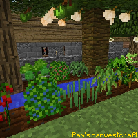
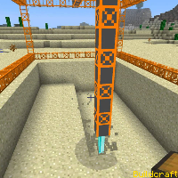
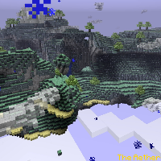
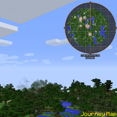
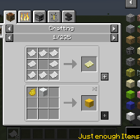

---
navigation:
  title: "Mods"
  icon: "minecraft:enchanted_book"
  position: 5
  parent: lexicon:modifications.md
---

# Mods

**Mods change Minecraft's game content in some way, such as to make minor adjustments to the game's mechanics or implement entirely new features. 

Most mods require a *Modloader* like [Forge](https://files.minecraftforge.net/net/minecraftforge/forge), [NeoForge](https://neoforged.net/) or [Fabric](https://fabricmc.net/use/installer). 

- You can find a lot of mods [here](https://www.curseforge.com/minecraft/mc-mods)

And here you will find a few more mods from me :) [*shameless self-promotion*](https://www.curseforge.com/members/xxrexraptorxx/projects)

  

 

