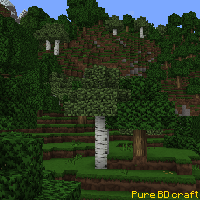
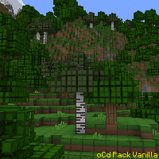
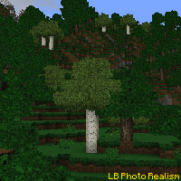
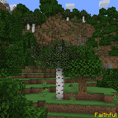
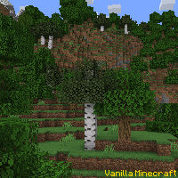

---
navigation:
  title: "Resource Packs"
  icon: "minecraft:enchanted_book"
  position: 2
  parent: lexicon:modifications.md
---

# Resource Packs

*Resource packs* provides a way to customize textures, models, music, sounds, languages, texts such as the end poem, splashes, credits, and fonts without any code modification. 

These packs can be stacked. *Resource packs* type. 

- *Resource packs* can be placed in the folder **resourcepacks** within the **.minecraft** folder.

- You can find new packs [here](https://www.curseforge.com/minecraft/texture-packs)

  

 

-----

## Pack format

Pack format, sometimes referred to as pack version, is a number used in **pack.mcmeta** to describe what Java Edition versions a [*Resource Pack*](./resourcepacks.md) or [*Data Pack*](./datapacks.md) is compatible with. 

Each version specifies the pack formats it supports in its **version.json** 

You can find a list with all pack format numbers [here](https://minecraft.wiki/w/Pack_format)

