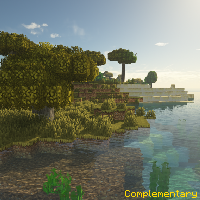
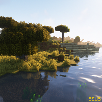
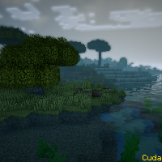
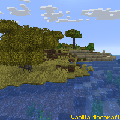

---
navigation:
  title: "Shader Packs"
  icon: "minecraft:enchanted_book"
  position: 4
  parent: lexicon:modifications.md
---

# Shader Packs

With *Shader packs* you add new light, shadow and water effects to the game. 

Shaders use quite a lot of power, so you should have a strong computer. 

----

To use shader, you need [*Mods*](./mods.md) like __Optifine__ or __Iris__. 

- They can be placed in the folder **shaderpacks** within the **.minecraft** folder.

- You can find shaders [here](https://www.curseforge.com/minecraft/customization/search?search=shader)

   

