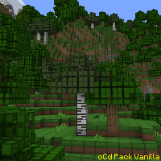
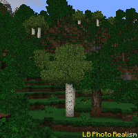
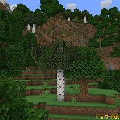

---
navigation:
  title: "Texture Packs"
  icon: "minecraft:enchanted_book"
  position: 1
  parent: lexicon:modifications.md
---

# Texture Packs

Texture packs are the most common [*Resource Packs*](./resourcepacks.md), they change the look of the game with other textures and sometimes new block/item models. 

These packs can be stacked 

- *Texture packs* can be placed in the folder **resourcepacks** within the **.minecraft** folder.

- You can find new packs [here](https://www.curseforge.com/minecraft/texture-packs)

TODO: Unsupported flag 'border'

