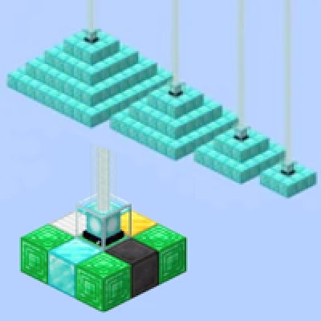

---
navigation:
  title: "Beacon"
  icon: "minecraft:beacon"
  parent: lexicon:rare_stuff.md
  item_ids:
    - minecraft:beacon
---

# Beacon

<ItemImage id="minecraft:beacon" />

A <ItemLink id="minecraft:beacon" /> is a block that projects a light beam skyward and can provide [*Status effects*](../brewing/effects.md) 
such as [*Speed*](../brewing/effects.md#speed), [*Jump Boost*](../brewing/effects.md#jump_boost),[*Haste*](../brewing/effects.md#haste), [*Regeneration*](../brewing/effects.md#regeneration), [*Resistance*](../brewing/effects.md#resistance),
or [*Strength*](../brewing/effects.md#strength) to nearby [*Players*](../creatures/human-player.md) when activated with a pyramid.

<RecipesFor id="minecraft:beacon" />

----

### The pyramid can be built with these block types:

- <ItemLink id="minecraft:iron_block" /> 
- <ItemLink id="minecraft:gold_block" /> 
- <ItemLink id="minecraft:emerald_block" /> 
- <ItemLink id="minecraft:diamond_block" /> 
- <ItemLink id="minecraft:netherite_block" />

There are four possible pyramid heights. More levels make more powers available. 
