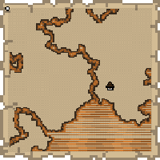
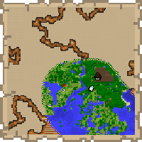

---
navigation:
  title: "Explorer Map"
  icon: "minecraft:filled_map"
  parent: lexicon:rare_stuff.md
---

# Explorer Map

<ItemImage id="minecraft:filled_map" />

An *Explorer Map* is a special *Map* used to aid in finding rare generated structures, including [*Woodland Mansions*](../world/structures.md#mansion), 
[*Ocean Monuments*](../world/structures.md#monument), and [*Buried Treasures*](../world/structures.md#treasure). 

These maps can be traded from a [*Cartographer Villager*](../creatures/human-villager.md#cartographer) or found in [*Ocean Ruins*](../world/structures.md#ruin) or [*Shipwrecks*](../world/structures.md#shipwreck).

 

