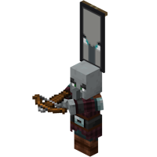

---
navigation:
  title: "Ominous Bottle"
  icon: "minecraft:ominous_bottle"
  parent: lexicon:rare_stuff.md
  item_ids:
    - minecraft:ominous_bottle
---

# Ominous Bottle

<ItemImage id="minecraft:ominous_bottle" />

An <ItemLink id="minecraft:ominous_bottle" /> is an item that gives a [*Players*](../creatures/human-player.md) the [*Bad Omen*](../brewing/effects.md#bad_omen) effect for 100 minutes when drunk. 

- They have 5 levels, which correspond with the 5 levels of the effect.
- They are dropped by [Raid Captains](../creatures/boss-raid_captain.md) outside of raids, at a random level.

