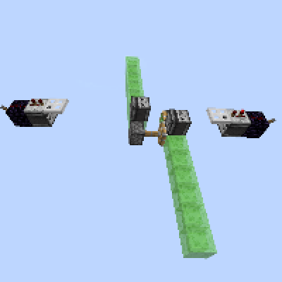
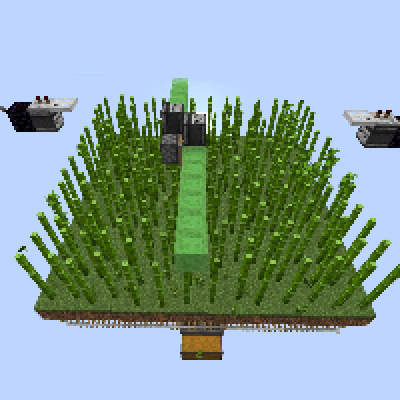

---
navigation:
  title: "Flying Machines"
  icon: "minecraft:slime_block"
  position: 4
  parent: lexicon:redstone.md
---

# Flying Machines

*Flying machines* are mechanisms that move a structure of blocks in one or more directions, moving freely through air or water without support. 

They can also be designed to carry along a [*Player*](../creatures/human-player.md) and/or other entities, which may be riding in a *Minecart* or towed along by *Honey Blocks*.

## Simple Flying Machine

<GameScene interactive={true} zoom={2}>
  <Block x="1" y="0" z="0" id="minecraft:redstone_block" />
  <Block x="4" y="0" z="0" id="minecraft:redstone_block" />
  <Block x="0" y="1" z="0" id="minecraft:piston"p:facing="south" />
  <Block x="1" y="1" z="0" id="minecraft:slime_block" />
  <Block x="2" y="1" z="0" id="minecraft:sticky_piston"p:facing="north" />
  <Block x="3" y="1" z="0" id="minecraft:piston"p:facing="south" />
  <Block x="4" y="1" z="0" id="minecraft:slime_block" />
</GameScene>

The central [*Sticky Piston*](./redstone_components.md#piston) is the starter that needs to be powered.

## Two-way Flying Machine

<GameScene interactive={true} zoom={2}>
  <Block x="1" y="0" z="0" id="minecraft:observer"p:facing="up" />
  <Block x="0" y="0" z="1" id="minecraft:observer"p:facing="up" />
  <Block x="0" y="1" z="0" id="minecraft:sticky_piston"p:facing="south" />
  <Block x="1" y="1" z="0" id="minecraft:slime_block" />
  <Block x="0" y="1" z="1" id="minecraft:slime_block" />
  <Block x="1" y="1" z="1" id="minecraft:sticky_piston"p:facing="north" />
</GameScene>

The [*Observer*](./redstone_components.md#observer) on each side start the machine and control the flight direction.

## Dock Flying Machines

<GameScene interactive={true} zoom={2}>
  <Block x="0" y="0" z="0" id="minecraft:iron_trapdoor"p:facing="north" p:half="bottom" />
  <Block x="1" y="0" z="0" id="minecraft:repeater"p:facing="south" p:delay="2" />
  <Block x="2" y="0" z="0" id="minecraft:redstone_wire"p:north="side" p:south="side" />
  <Block x="1" y="1" z="0" id="minecraft:observer"p:facing="north" />
  <Block x="2" y="1" z="0" id="minecraft:obsidian" />
  <Block x="3" y="1" z="0" id="minecraft:lever"p:face="wall" p:facing="south" />
</GameScene>

Needed to stop *Flying Machines* or reverse their flying direction.

## Harvesting Flying Machine

<GameScene interactive={true} zoom={2}>
  <Block x="1" y="0" z="9" id="minecraft:observer"p:facing="up" />
  <Block x="0" y="0" z="10" id="minecraft:observer"p:facing="up" />
  <Block x="1" y="1" z="0" id="minecraft:slime_block" />
  <Block x="1" y="1" z="1" id="minecraft:slime_block" />
  <Block x="1" y="1" z="2" id="minecraft:slime_block" />
  <Block x="1" y="1" z="3" id="minecraft:slime_block" />
  <Block x="1" y="1" z="4" id="minecraft:slime_block" />
  <Block x="1" y="1" z="5" id="minecraft:slime_block" />
  <Block x="1" y="1" z="6" id="minecraft:slime_block" />
  <Block x="1" y="1" z="7" id="minecraft:slime_block" />
  <Block x="1" y="1" z="8" id="minecraft:slime_block" />
  <Block x="0" y="1" z="9" id="minecraft:sticky_piston"p:facing="south" />
  <Block x="1" y="1" z="9" id="minecraft:slime_block" />
  <Block x="0" y="1" z="10" id="minecraft:slime_block" />
  <Block x="1" y="1" z="10" id="minecraft:sticky_piston"p:facing="north" />
  <Block x="0" y="1" z="11" id="minecraft:slime_block" />
  <Block x="0" y="1" z="12" id="minecraft:slime_block" />
  <Block x="0" y="1" z="13" id="minecraft:slime_block" />
  <Block x="0" y="1" z="14" id="minecraft:slime_block" />
  <Block x="0" y="1" z="15" id="minecraft:slime_block" />
  <Block x="0" y="1" z="16" id="minecraft:slime_block" />
  <Block x="0" y="1" z="17" id="minecraft:slime_block" />
  <Block x="0" y="1" z="18" id="minecraft:slime_block" />
  <Block x="0" y="1" z="19" id="minecraft:slime_block" />
</GameScene>

This machine with it's outlets can be used for harvesting in e.g. *Bamboo* farms

TODO: Unsupported flag 'border'

