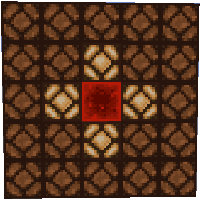
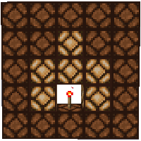
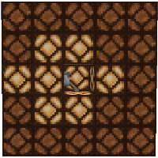

---
navigation:
  title: "Redstone Behavior"
  icon: "minecraft:redstone"
  position: 1
  parent: lexicon:redstone.md
---

# Redstone Behavior

[*Redstone Wire*](./redstone_components.md#redstone) can transmit power, which can be used to operate mechanism components (doors, pistons, etc.). 

The power level drops by 1 for every block of [*Redstone Wire*](./redstone_components.md#redstone) it crosses. 

Thus, wire can transmit power for no more than __15 blocks__. 
To go further, the power level must be re-strengthened – typically with a [*Repeater*](./redstone_components.md#repeater).

Examples of redstone wire configurations.

 

-----

The following pages show how different redstone components pass on their signals.

-----

Wall Lever

-----

Redstone Wires

-----

Repeater to wall

-----

Standing Torch

-----

Wall Torch

-----

Wall Lever

-----

Redstone torches change states when powered.

