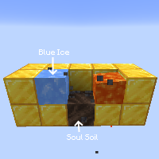

---
navigation:
  title: "Basalt Generator"
  icon: "minecraft:basalt"
  parent: lexicon:tips_tricks.md
  item_ids:
    - minecraft:basalt
    - minecraft:polished_basalt
    - minecraft:smooth_basalt
---

# Basalt Generator

*Lava* will turn to *Basalt* when it is above a *Soul Soil* block while also adjacent to a *Blue Ice* block. 

The *Soul Soil* block **MUST** be beneath the *Lava*, but the *Blue Ice* block can be on any side or above.

 

