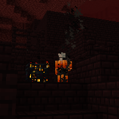

---
navigation:
  title: "Snowballs against Blazes"
  icon: "minecraft:snowball"
  parent: lexicon:tips_tricks.md
---

# Snowballs against Blazes

[*Blazes*](../creatures/monster-blaze.md) can be quite dangerous, but they have a big weak point, they take damage from *Snowballs*. 

The good thing is that these are easy to obtain.

