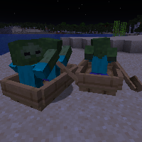

---
navigation:
  title: "Boat Trap"
  icon: "minecraft:oak_boat"
  parent: lexicon:tips_tricks.md
---

# Boat Trap

*Boats* can be used to fend off mobs. 

You just have to put them in their way and they get trapped in the *Boat*.

TODO: Unsupported flag 'border'

