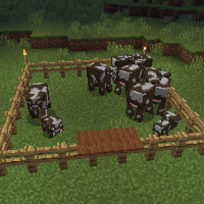

---
navigation:
  title: "Carpet Fence Trick"
  icon: "minecraft:cyan_carpet"
  parent: lexicon:tips_tricks.md
---

# Carpet Fence Trick

*Carpets* on *Fences* have a special property, they allow you to easily climb over the *Fence*, but prevent animals and monsters from climbing over them. 

That can be used for enclosures and monster defense screens.

TODO: Unsupported flag 'border'

