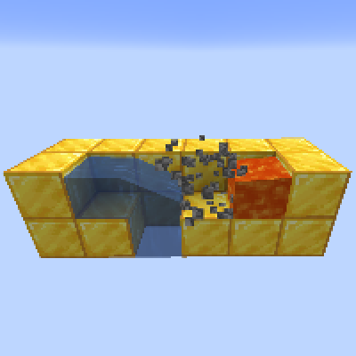

---
navigation:
  title: "Cobblestone Generator"
  icon: "minecraft:cobblestone"
  parent: lexicon:tips_tricks.md
---

# Cobblestone Generator

*Cobblestone generators* work on the principle that when a *Lava* stream comes into contact with *Water*, the *Lava* is turned into *Cobblestone*. 

This fresh block then prevents the two streams from touching. 
When this fresh *Cobblestone* is removed, the two fluids produce another piece of *Cobblestone*.

