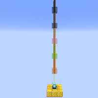

---
navigation:
  title: "Colored Beacon Beam"
  icon: "minecraft:beacon"
  parent: lexicon:tips_tricks.md
---

# Colored Beacon Beam

The color of the [*Beacon*](../rare/beacon.md) beam may be changed by placing blocks of *Stained Glass* or *Stained Glass Panes* anywhere above the *Beacon Block*. 

The beam changes colors according to the colors of *Glass* placed above it: the first block sets the beam color, while each additional block sets the color by averaging the red, green, and blue components of the current beam color and the block's color.

TODO: Unsupported flag 'border'

