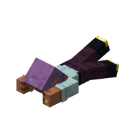

---
navigation:
  title: "Crawling"
  icon: "minecraft:player_head"
  parent: lexicon:tips_tricks.md
---

# Crawling

Crawling is a mechanic that prevents the [*Players*](../creatures/human-player.md) from suffocating when inside small gaps. 

Crawling covers a pose that occurs when the [*Players*](../creatures/human-player.md) are in an area less than 1.5 blocks high. 

The crawling speed equals sneaking speed.

The speed can be increased with the [*Swift Sneak*](../enchanting/enchantments.md#swift_sneak) enchantment.

------

## Entering crawling

Crawling is initiated automatically in any situation that would cause the player's head to intersect a block in such a way that the area underneath the block is less than 1.5 blocks. 

__For example:__ 
- Closing a [*Trapdoor*](../redstone/redstone_components.md#trapdoor) on the [*Player*](../creatures/human-player.md) 
- Closing a [*Fence Gate*](../redstone/redstone_components.md#fence_gate) when it is at the same altitude as the head 
- Using a [*Piston*](../redstone/redstone_components.md#piston) to push a block into the [*Player*](../creatures/human-player.md)
- Exiting swimming mode in a one-block-high space 
- Exiting [*Elytra*](../rare/elytra.md) mode in a one-block-high space 
- Throwing an *Ender Pearl* into a one block space 
- Having a [*Shulker Box*](../useables/shulker_box.md) push the [*Player*](../creatures/human-player.md) down 
- Getting off a [*Pig*](../creatures/animal-pig.md) with a *Saddle* if it's under a one-block-high space 
- Having a *Boat* land on the player's head

