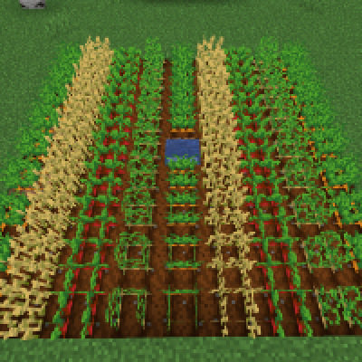

---
navigation:
  title: "Crop alternating"
  icon: "minecraft:wheat"
  parent: lexicon:tips_tricks.md
---

# Crop alternating

If you're farming multiple crops, make sure to alternate the crop types by row. 

For example, the first row can be *Wheat*, the second row can be *Carrots*, and the third row can be *Potatoes*, after which the pattern repeats itself again. 

This has been proven to boost crop growth in a noticeable way.

If you grow your fields underground, make sure to light it up.

TODO: Unsupported flag 'border'

