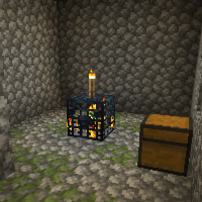
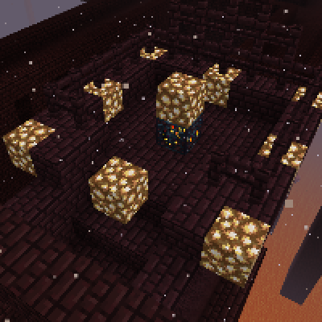

---
navigation:
  title: "Deactivate Spawners"
  icon: "minecraft:spawner"
  parent: lexicon:tips_tricks.md
---

# Deactivate Spawners

You should never mine *Spawners*, they can still be very useful for e.g. mob traps or simply farming. 

You should try deactivating them with light instead. 
Just put a *Torch* or something like that on the *Spawner*. 

Only [*Blaze*](../creatures/monster-blaze.md) & [*Silverfish*](../creatures/arthropod-silverfish.md) *Spawners* need a lot more light in the area to disable it.

TODO: Unsupported flag 'border'

