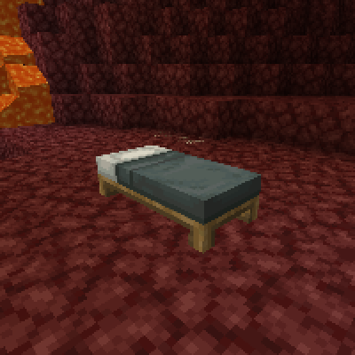
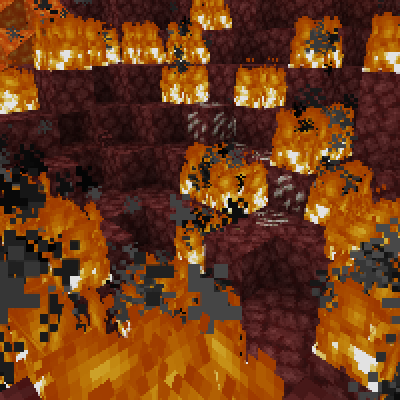

---
navigation:
  title: "Beds in other Dimensions"
  icon: "minecraft:yellow_bed"
  parent: lexicon:tips_tricks.md
---

# Beds in other Dimensions

[*Beds*](../useables/bed.md) don't work in many other dimensions, and would explode if you tried to use them. 

Instead, for example, a [*Respawn Anchor*](../useables/respawn_anchor.md) must be used in the [*Nether*](../world/dimensions.md#nether), to set the spawn point. 

But the [*Bed*](../useables/bed.md) can be useful for cheaply blowing up terrain.

TODO: Unsupported flag 'border'

